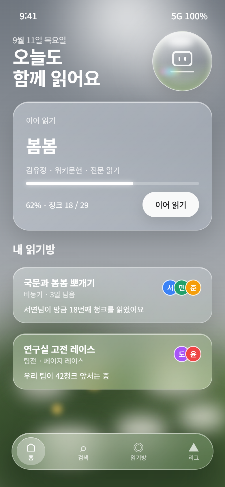
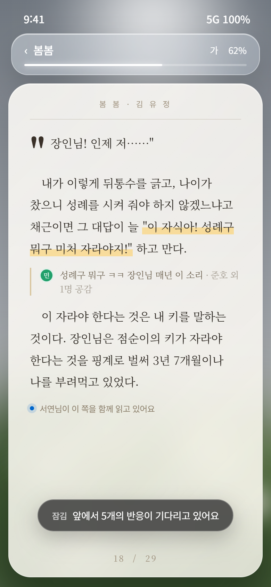
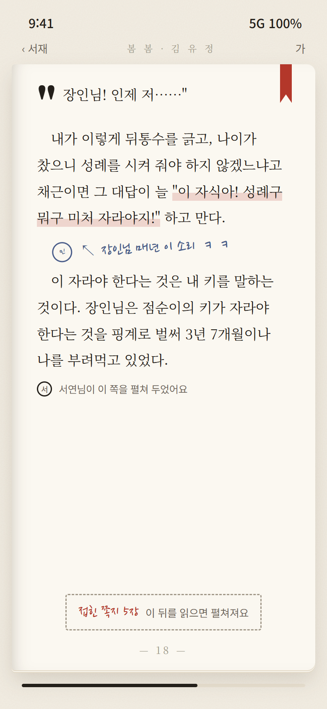
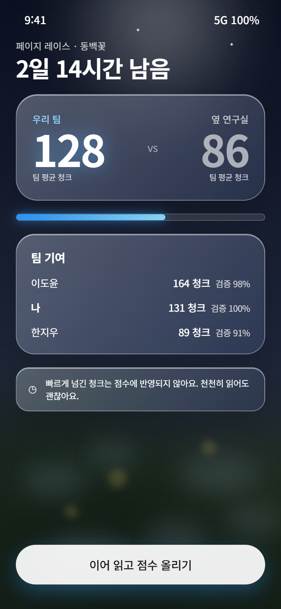
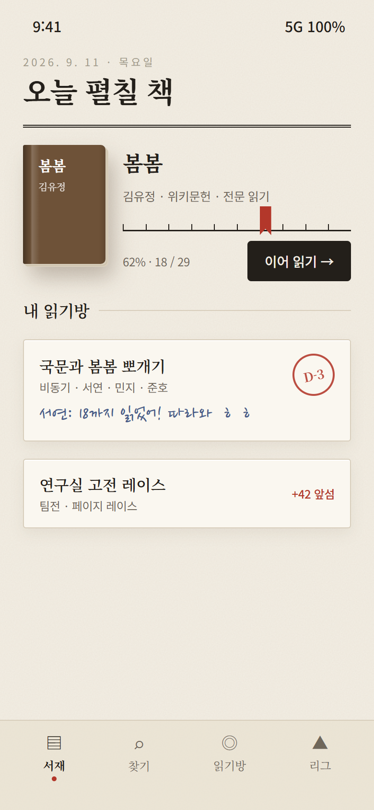
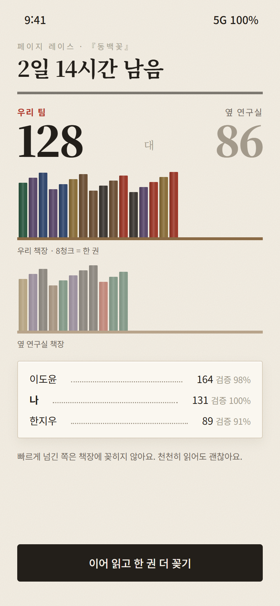

<div align="center">

# 함께읽기 · Saipr

**혼자 읽기엔 흐지부지, 독서모임은 부담스러운 사람들을 위한 소셜 독서 레이어**

같은 책을 각자의 속도로 읽으면서 친구의 진행률과 문단 반응이 실시간으로 겹쳐 보이고,
팀을 짜서 공정한 페이지 레이스로 경쟁합니다.

📄 **[PRD](docs/PRD.md)** · 🎨 [디자인 시스템](docs/design-system.md) · 🗳 [디자인 시안 투표](docs/design-vote.md) · 🏗 [아키텍처](docs/architecture.md) · 🎯 [GOAL](GOAL.md) · 🖼 [Figma](https://www.figma.com/design/mp2nKNmBdJ7Dg2rc2p9rht)

  

</div>

---

## 왜 만드나

| 기존 | 한계 | 함께읽기 |
|---|---|---|
| 밀리의서재 | 개인 챌린지뿐, 유저 간 대결 없음 | 친구·팀 대항 페이지 레이스 |
| 실시간 함께읽기 서비스 | 같은 시간에 접속해야 함 | **비동기 기본** — 먼저 읽은 친구의 반응이 문단 옆에 남음 |
| 독서 기록 SNS | 다 읽은 뒤 피드 공유에 그침 | **읽는 도중**의 동행 |
| 공통 | 콘텐츠 라이선싱이 진입장벽 | 본문은 퍼블릭 도메인만, 나머지는 메타데이터 + 진행률 |

타깃: 독서모임은 부담스럽고 혼자 읽기는 지속이 안 되는 대학생·2030. 자세한 페르소나·사용자 스토리·기능 명세·성공 지표는 **[PRD](docs/PRD.md)**.

## 핵심 개념

- **하이브리드 콘텐츠** — 저작권 만료작(위키문헌·Gutendex)은 앱 안 리더로 전문을 읽고, 시판 도서는 카카오·네이버·Google Books 메타데이터와 수동 진행률로 기록합니다. 본문 제공 소스는 코드에서 화이트리스트로 강제합니다.
- **청크 = 공통 위치** — 판본·기기마다 달라지는 "페이지" 대신 본문을 결정적으로 나눈 청크를 좌표로 씁니다. 그래서 반응이 모든 사람에게 같은 문단에 겹칩니다.
- **스포일러 가드** — 내가 아직 안 읽은 위치의 반응은 내용 없이 "앞에서 N개의 반응이 기다리고 있어요"로만 보입니다.
- **체류시간 검증** — 청크 글자 수 대비 최소 체류시간을 서버가 판정해, 넘기기만 한 구간은 레이스 점수에서 빠집니다.

## 화면 — 두 시안 투표 중

같은 6화면을 두 방향으로 만들었습니다. 비교와 판단 기준은 [디자인 시안 투표](docs/design-vote.md).

| | 홈 | 리더 | 레이스 |
|---|---|---|---|
| **A · Grass** |  |  |  |
| **B · Paper** |  |  |  |

## 저장소 구성

현재 저장소에는 두 개의 서버 코드가 함께 있습니다.

| 경로 | 내용 | 스택 |
|---|---|---|
| `app/`, `migrations/`, `tests/` | 도서 검색·전문 청크화 API (PRD Phase 0–1) | Python 3.12 · FastAPI · SQLAlchemy · Alembic |
| `src/`, `build.gradle` | 세션 기반 회원가입·로그인 ([아래](#spring-boot-인증-서버)) | Java 21 · Spring Boot · Spring Security |
| `docs/` | PRD · 디자인 시스템 · 시안 목업(HTML) · 아키텍처 | |

> ⚠️ 두 서버의 역할 분담(인증은 Spring, 도서·읽기방은 FastAPI로 나눌지, 하나로 통일할지)은 팀 합의가 필요합니다. PRD의 인증 명세(AUTH-01, 소셜 로그인)도 이 결정에 맞춰 갱신할 예정입니다.

## 빠른 시작 — 도서 API (Python)

```bash
cp .env.example .env          # API 키는 선택 — 없으면 Google Books·위키문헌·Gutendex만 사용
docker compose up --build     # Postgres + API, 마이그레이션 자동 적용
```

```bash
# 검색 (여러 소스 병렬 조회, 실패한 소스는 errors에 표시)
curl "localhost:8000/api/v1/books/search?q=봄봄"

# 퍼블릭 도메인 전문 가져오기 → 청크 읽기
curl -X POST localhost:8000/api/v1/books/import \
     -H "Content-Type: application/json" \
     -d '{"source": "wikisource", "external_id": "봄봄"}'
curl localhost:8000/api/v1/books/1/chunks/0
```

API 문서는 서버 실행 후 <http://localhost:8000/docs>.

로컬 개발:

```bash
python -m venv .venv && source .venv/bin/activate   # Windows: .venv\Scripts\activate
pip install -e ".[dev]"
pytest -q          # 외부 네트워크 없이 실행 (httpx.MockTransport + in-memory SQLite)
ruff check .
uvicorn app.main:app --reload
```

| 환경 변수 | 필수 | 설명 |
|---|---|---|
| `DATABASE_URL` | ✅ | `postgresql+asyncpg://…` |
| `KAKAO_REST_API_KEY` | | 카카오 도서검색 (국내 1순위) |
| `NAVER_CLIENT_ID` / `NAVER_CLIENT_SECRET` | | 네이버 책 검색 (보조) |
| `GOOGLE_BOOKS_API_KEY` | | 없으면 낮은 쿼터로 동작 |
| `WIKISOURCE_LANG` | | 기본 `ko` |

## 로드맵

- [x] Phase 0 — 스캐폴딩 · DB · Docker · CI
- [x] Phase 1 — 도서 소스 어댑터 · 통합 검색 · 전문 청크화
- [x] 세션 기반 회원가입·로그인 (Spring Boot, PR #1)
- [ ] 디자인 시안 확정 (A / B 투표)
- [ ] Phase 2 — 소셜 로그인 · 내 서재 · 리더 이벤트 · 트래커 모드
- [ ] Phase 3 — 읽기방 · WebSocket 진행률 동기화 · 문단 반응 · 스포일러 가드
- [ ] Phase 4 — 페이지 레이스 · 한줄평 배틀 · 포인트
- [ ] Phase 5 — 팀 · 주간 리그
- [ ] Phase 6 — 푸시 알림 · 배포

완료 기준은 [GOAL.md](GOAL.md)에 측정 가능한 형태로 정리되어 있습니다.

## 콘텐츠·약관 원칙

- 퍼블릭 도메인이 아닌 본문은 저장·배포하지 않습니다.
- 알라딘 Open API는 법인 사업자의 도서정보 서비스 이용 제한 조항 때문에 사용하지 않습니다.
- 외부 검색 결과에는 원 출처 링크를 함께 제공합니다.

---

## Spring Boot 인증 서버

> PR #1에서 추가된 인증 모듈의 원문 문서입니다.

Java 21 / Spring Boot 4.0.8 / Spring Security 기반 세션 인증 프로젝트입니다.

### 실행

JDK 21을 설치하고 `JAVA_HOME`을 설정한 뒤 프로젝트 루트에서 실행합니다.

```powershell
.\gradlew.bat bootRun
```

macOS/Linux에서는 `sh ./gradlew bootRun`을 실행합니다. 최초 실행 시 Gradle 및 의존성을 다운로드하므로 인터넷 연결이 필요합니다.
브라우저에서 http://localhost:8080 에 접속하면 로그인 화면이 표시됩니다. 회원가입 후 이메일과 비밀번호로 로그인합니다.
IntelliJ에서는 `build.gradle`을 Gradle 프로젝트로 열고 Gradle JVM을 JDK 21로 지정합니다.

### 기능과 인증 흐름

- `GET /signup`: 회원가입 화면
- `POST /signup`: 이름, 이메일, 비밀번호, 비밀번호 확인으로 가입. 성공 시 `/login?registered`로 이동
- `GET /login`: 로그인 화면
- `POST /login`: `email`, `password` 폼 필드로 로그인. 성공 시 `/`, 실패 시 `/login?error`로 이동
- `GET /`: 로그인한 회원 이름과 이메일 표시
- `GET /api/auth/me`: 현재 회원의 `id`, `email`, `name` JSON. 미인증 시 401
- `POST /logout`: 세션 무효화 및 쿠키 제거 후 `/login?logout`로 이동

POST 요청의 Content-Type은 `application/x-www-form-urlencoded`입니다. Thymeleaf 폼에 CSRF 토큰이 자동 포함됩니다. 외부 클라이언트는 먼저 폼 페이지를 요청하여 세션 쿠키와 숨겨진 `_csrf` 필드를 받고, 같은 쿠키와 토큰을 POST에 함께 전송해야 합니다. 로그인 후에는 CSRF 토큰이 교체되므로 새 페이지의 토큰을 사용합니다.

Spring Security가 인증 정보를 서버의 HttpSession에 저장합니다. 브라우저는 HttpOnly / SameSite=Lax인 JSESSIONID 쿠키를 사용하며, URL에 세션 ID를 붙이지 않습니다. 로그인 시 기존 세션 ID를 교체하고, 30분 동안 요청이 없으면 세션이 만료됩니다. 세션은 애플리케이션 메모리에 있으므로 재시작하면 다시 로그인해야 합니다.

이메일은 앞뒤 공백을 제거하고 소문자로 저장/조회합니다. DB UNIQUE 제약으로 동시 가입의 이메일 중복도 차단합니다. 비밀번호는 BCrypt(cost 12)로 해시하며, 8자 이상 및 UTF-8 기준 최대 72바이트를 검증합니다. 검증 실패 화면에 비밀번호를 다시 출력하지 않습니다.

### 데이터 및 환경 설정

기본 DB는 파일 기반 H2(`./data/saipr`)로, 회원 정보는 재시작 후에도 유지됩니다. 데이터 파일은 Git에서 제외됩니다. H2 콘솔은 활성화하지 않았습니다.

| 환경 변수 | 기본값 | 용도 |
| --- | --- | --- |
| `DB_URL` | `jdbc:h2:file:./data/saipr` | 데이터베이스 연결 주소 |
| `DB_USERNAME` | `sa` | DB 사용자 |
| `DB_PASSWORD` | 빈 값 | DB 비밀번호 |
| `SESSION_COOKIE_SECURE` | `false` | HTTPS 배포 시 `true`로 설정 |

기본 설정은 로컬 개발용입니다. HTTPS 배포 시 Secure 쿠키를 활성화하고 DB 자격 증명을 환경 변수로 설정하세요. 다른 DB로 전환할 경우 해당 JDBC 드라이버와 스키마 마이그레이션이 필요합니다. 여러 서버에서 세션을 공유하는 구성, 이메일 소유 확인, 비밀번호 재설정, 로그인 시도 제한은 현재 범위에 포함하지 않습니다.

### 검증

```powershell
.\gradlew.bat test
.\gradlew.bat bootJar
```

통합 테스트는 실제 SecurityFilterChain과 메모리 H2를 사용하여 가입/중복/유효성 검증, 비밀번호 해시, 로그인 성공/실패, 세션 유지 및 ID 갱신, 미인증 접근 차단, CSRF, 로그아웃을 검사합니다.

참고: [Spring Security 폼 로그인](https://docs.spring.io/spring-security/reference/7.0/servlet/authentication/passwords/form.html), [CSRF 보호](https://docs.spring.io/spring-security/reference/7.0/servlet/exploits/csrf.html).
