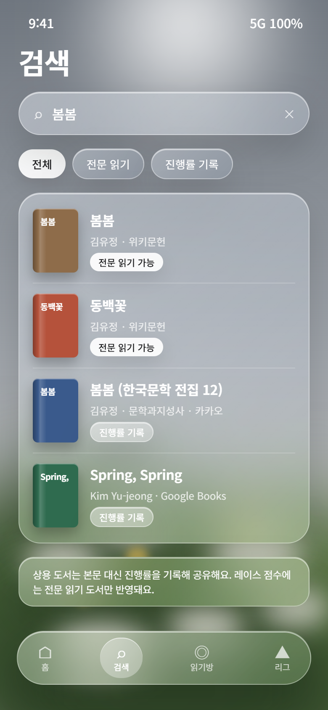
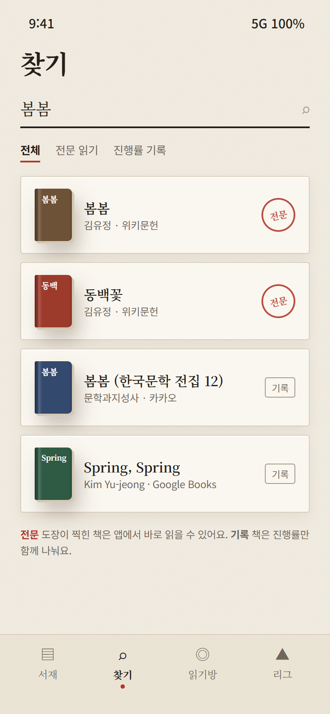
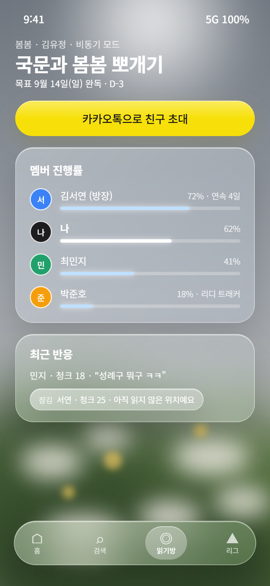
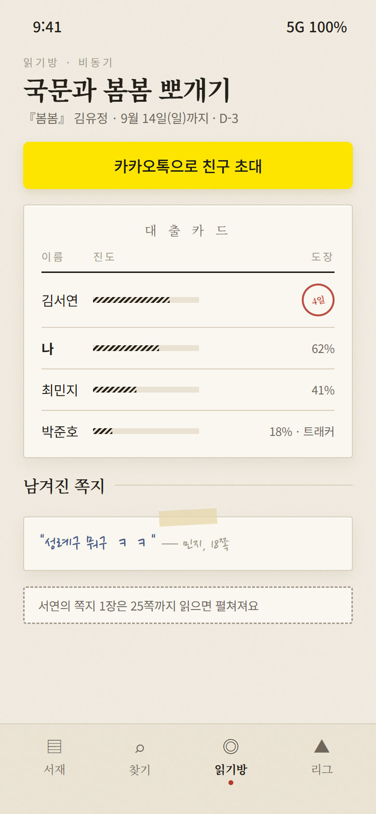
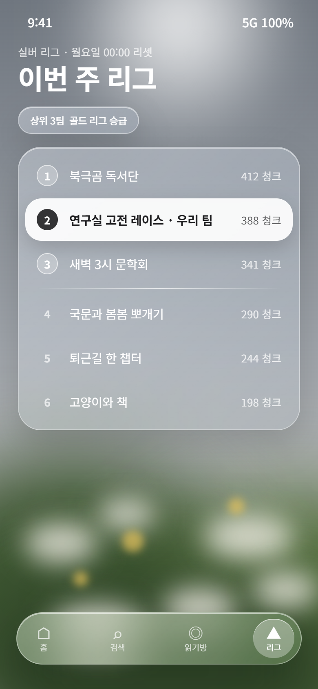
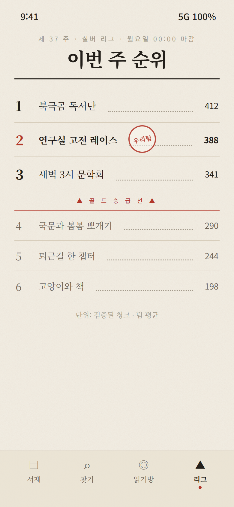

# 디자인 시안 투표 — A 유리 vs B 종이 서재

두 시안 모두 같은 PRD, 같은 6화면, 같은 데이터로 만들었습니다. **화면 구성과 기능은 같고 분위기만 다릅니다.**

| | 시안 A · Glass | 시안 B · 종이 서재 |
|---|---|---|
| 한 줄 | 사진 같은 풍경 위에 떠 있는 유리 | 손때 묻은 책과 서재 |
| 분위기 | 산뜻함 · 요즘 앱 · Apple 감성 | 따뜻함 · 아날로그 · 문학적 |
| 친구의 흔적 | 반투명 반응 카드, 아바타 | 연필 메모, 접힌 쪽지, 도장, 책갈피 |
| 경쟁 표현 | 발광 점수판, 줄다리기 바 | 쌓이는 책장, 신문 순위표 |
| 액센트 | 흰 알약 버튼 (+ 파랑) | 인주 빨강 |
| 원본 | [glass-v2.html](mockups/glass-v2.html) | [paper-b.html](mockups/paper-b.html) |

## 화면 비교

| | A · Glass | B · 종이 서재 |
|---|---|---|
| 홈 |  |  |
| 검색 |  |  |
| **리더** |  |  |
| 읽기방 |  |  |
| 레이스 |  |  |
| 리그 |  |  |

## 판단 기준 (각 1–5점)

1. **책 읽는 느낌** — 리더 화면에서 20분 읽고 싶은가?
2. **타깃 적합도** — 2030 대학생·직장인이 인스타 스토리에 공유하고 싶은가?
3. **함께 읽는 느낌** — 친구의 존재가 부담 없이, 그러나 분명히 느껴지는가?
4. **구현 비용** — A는 `backdrop-filter` 성능·저사양 기기 대응, B는 종이 질감 이미지·손글씨 폰트 로딩이 비용.

## PM 의견 (참고만)

- **A**는 첫인상과 공유성이 강하고, 레이스처럼 경쟁 화면에서 에너지가 좋습니다. 대신 긴 글을 읽는 화면에서는 유리가 방해가 되기 쉬워, 리더는 서리 유리 + 명조로 타협했습니다.
- **B**는 "책을 함께 읽는다"는 서비스 정체성과 가장 잘 맞고, 친구 반응을 연필 메모·접힌 쪽지로 표현해 스포일러 가드가 자연스럽게 설명됩니다. 대신 앱 전체가 차분해서 경쟁 요소의 긴장감은 약합니다.
- 절충안도 가능합니다: **B를 기본으로 하고 레이스·리그 화면만 A의 밤 유리 톤**을 쓰는 방식입니다.

## 투표

| 팀원 | A | B | 절충 | 한마디 |
|---|:-:|:-:|:-:|---|
| | | | | |
| | | | | |
| | | | | |
